# BMW E90 Dashboard Icon Library

44 icons — Wikimedia-sourced SVGs: [Category:Dashboard SVG icons](https://commons.wikimedia.org/wiki/Category:Dashboard_SVG_icons) (public domain / CC0); door/trunk icons: custom SVG.  
Target vehicle: E90 LCI N47D20O1 diesel, ZF 6HP19.

| Icon | File | Description | Colour | BMW E90 Context |
|------|------|-------------|--------|-----------------|
|  | [`engine_mil.svg`](svg/engine_mil.svg) | Engine Management Light (MIL / EML) | amber | Check engine / EML fault — emissions or engine management system |
| 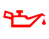 | [`oil_pressure.svg`](svg/oil_pressure.svg) | Engine Oil Pressure Warning | red | Oil pressure critically low — stop engine immediately |
| 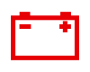 | [`battery_charge.svg`](svg/battery_charge.svg) | Battery / Alternator Charging Fault | red | Alternator not charging — drive to workshop |
|  | [`electrical_fault.svg`](svg/electrical_fault.svg) | General Electrical Fault | amber | Electrical system fault — various modules |
|  | [`immobiliser.svg`](svg/immobiliser.svg) | Immobiliser / EWS Active | red | EWS 3.3/4.0 immobiliser indicator — stays on if armed |
|  | [`ewslock.svg`](svg/ewslock.svg) | Anti-Theft / Immobiliser Warning | red | EWS immobiliser triggered or fault |
|  | [`brake_warning.svg`](svg/brake_warning.svg) | Brake System Warning (Critical) | red | Brake circuit failure — stop safely immediately |
|  | [`parking_brake.svg`](svg/parking_brake.svg) | Parking Brake / Handbrake | red | Handbrake applied or EPB fault |
| 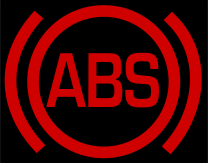 | [`abs_warning.svg`](svg/abs_warning.svg) | ABS Warning | amber | ABS malfunction — normal braking retained |
| 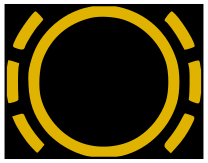 | [`brake_wear.svg`](svg/brake_wear.svg) | Brake Pad Wear Indicator | amber | CBS brake service due — pads worn |
|  | [`brake_fluid.svg`](svg/brake_fluid.svg) | Brake Fluid Level Low | amber | Brake fluid reservoir below minimum |
|  | [`brake_alert.svg`](svg/brake_alert.svg) | Braking System Alert | red | General braking system alert |
|  | [`airbag_srs.svg`](svg/airbag_srs.svg) | Airbag / SRS Warning | red | Airbag or seatbelt pretensioner system fault |
| 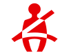 | [`seatbelt.svg`](svg/seatbelt.svg) | Seatbelt Reminder | red | Driver or passenger seatbelt not fastened |
|  | [`dsc_esp.svg`](svg/dsc_esp.svg) | DSC / ESP Stability Control | amber | DSC off, DTC mode, or stability system fault |
|  | [`dsc_esp2.svg`](svg/dsc_esp2.svg) | DSC / ESP (variant 2) | amber | Alternative DSC symbol variant |
|  | [`traction_control.svg`](svg/traction_control.svg) | Traction Control (ASC/TC) | amber | ASC/TC active (flashing) or disabled/fault (steady) |
|  | [`glow_plug.svg`](svg/glow_plug.svg) | Glow Plug / Preheat Indicator | amber | Diesel preheat in progress (steady) or fault (flashing) |
| 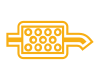 | [`dpf.svg`](svg/dpf.svg) | Diesel Particulate Filter (DPF) | amber | DPF regeneration required — take for motorway run |
|  | [`tyre_pressure.svg`](svg/tyre_pressure.svg) | Tyre Pressure Warning (iTPMS) | amber | Tyre pressure loss detected — check all tyres |
|  | [`power_steering.svg`](svg/power_steering.svg) | Power Steering (EPS/EPAS) Fault | amber | Electric power steering system fault |
|  | [`fuel_low.svg`](svg/fuel_low.svg) | Fuel Level Low | amber | Reserve fuel warning — approx. 8–12 L remaining |
|  | [`washer_fluid.svg`](svg/washer_fluid.svg) | Washer Fluid Level Low | amber | Screen wash reservoir low |
| 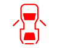 | [`door_open.svg`](svg/door_open.svg) | Any Door / Boot / Bonnet Open | red | Any door, boot or bonnet not fully closed (generic) |
| 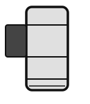 | [`door_front_left.svg`](svg/door_front_left.svg) | Front Left Door Open | red | Front left (driver LHD / passenger RHD) door open |
| 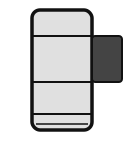 | [`door_front_right.svg`](svg/door_front_right.svg) | Front Right Door Open | red | Front right (passenger LHD / driver RHD) door open |
| 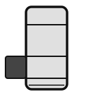 | [`door_rear_left.svg`](svg/door_rear_left.svg) | Rear Left Door Open | red | Rear left door open |
| 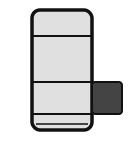 | [`door_rear_right.svg`](svg/door_rear_right.svg) | Rear Right Door Open | red | Rear right door open |
| 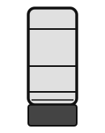 | [`trunk_open.svg`](svg/trunk_open.svg) | Trunk / Boot Open | red | Boot/trunk lid not fully latched |
|  | [`high_beam.svg`](svg/high_beam.svg) | High Beam (Main Beam) On | blue | Main beam headlights active |
|  | [`low_beam.svg`](svg/low_beam.svg) | Low Beam (Dipped Headlights) On | green | Dipped headlights active |
|  | [`driving_lights.svg`](svg/driving_lights.svg) | Driving / Running Lights On | green | Driving lights indicator (alternate symbol variant) |
|  | [`fog_front.svg`](svg/fog_front.svg) | Front Fog Light Active | green | Front fog lights switched on |
| 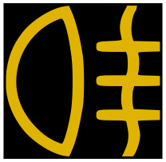 | [`fog_rear.svg`](svg/fog_rear.svg) | Rear Fog Light Active | amber | Rear fog light switched on |
|  | [`parking_lights.svg`](svg/parking_lights.svg) | Parking / Sidelights On | green | Parking/side lights active |
|  | [`sidelights_markers.svg`](svg/sidelights_markers.svg) | Sidelights / Marker Lights On | green | Position/marker/sidelights only — no driving lights |
|  | [`indicator_left.svg`](svg/indicator_left.svg) | Left Turn Signal | green | Left indicator / turn signal flashing |
|  | [`indicator_right.svg`](svg/indicator_right.svg) | Right Turn Signal | green | Right indicator / turn signal flashing |
| 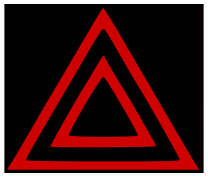 | [`hazard.svg`](svg/hazard.svg) | Hazard Warning Lights | red | Hazard / emergency flashers active |
|  | [`drl.svg`](svg/drl.svg) | Daytime Running Lights (DRL) | green | Automatic DRL active (LA light package or retrofit) |
| 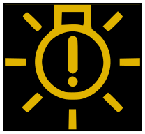 | [`bulb_failure.svg`](svg/bulb_failure.svg) | Exterior Bulb Failure | amber | One or more exterior lamps failed — CBS light check |
|  | [`headlamp_levelling.svg`](svg/headlamp_levelling.svg) | Headlamp Levelling / Range Control | amber | Automatic or manual headlamp levelling system fault |
| 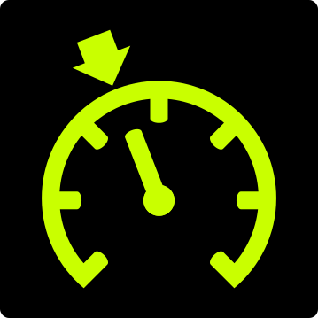 | [`cruise_control.svg`](svg/cruise_control.svg) | Cruise Control / Speed Limiter | green | Cruise control or speed limiter active |
|  | [`bend_lighting.svg`](svg/bend_lighting.svg) | Adaptive Headlight Malfunction | amber | Adaptive/cornering headlight system fault |
